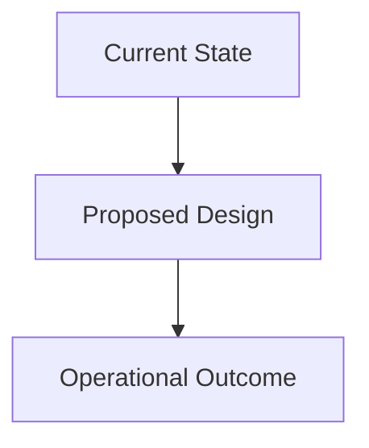

# Presentation Deck (Markdown Source)

## Change log
- YYYY-MM-DD: Initial draft

## Slide 1 - Title and objective
- Title: TODO
- Objective: TODO
- Speaker notes: TODO

## Slide 2 - Problem and context
- TODO
- Speaker notes: TODO

## Slide 3 - Recommended approach
- TODO
- Speaker notes: TODO

## Slide 4 - Architecture/flow
- TODO



- Speaker notes: TODO

## Slide 5 - Implementation plan
- TODO
- Include code or command snippet if useful:
```text
# TODO
```
- Speaker notes: TODO

## Slide 6 - Risks and gotchas
- TODO
- Speaker notes: TODO

## Slide 7 - Security summary
- TODO
- Speaker notes: TODO

## Slide 8 - Decision and next steps
- TODO
- Speaker notes: TODO

## Visual assets referenced
- `artifacts/deck/images/architecture.png` (if available)
