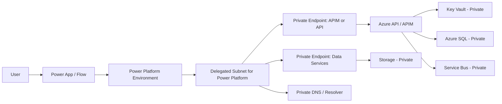
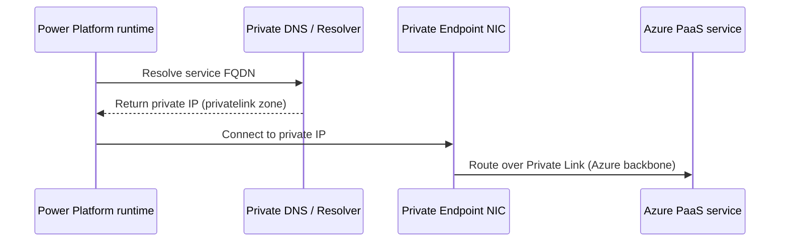

# Research Artifact

## Change log
- 2026-02-23: Replaced template with deep research for "Power Platform to private-only Azure resources".

## Executive summary
- Power Platform can securely connect to Azure resources with no public endpoint by using Power Platform Virtual Network support (subnet delegation) plus private endpoints on each target Azure service.
- The most robust enterprise pattern is: Power Platform (managed environment) -> delegated subnet -> private endpoint-enabled API/data services -> public access disabled on those services.
- DNS design is a first-class dependency. Private DNS zone setup (or equivalent custom DNS forwarding) is mandatory for reliable private endpoint resolution.
- Security and operability improve significantly with: Entra-based auth, managed identities, strict outbound policies (NSG/UDR/Firewall), and staged cutover before disabling public endpoints.

## Context and problem framing
- **Goal**: Enable Power Platform workloads (apps/flows/connectors/plugins) to access Azure resources while keeping Azure resources inaccessible from public internet.
- **Constraint**: "No public endpoint" means connectivity must work through private networking (Private Link/private endpoint or tightly controlled internal paths), not public allowlists.
- **Reality check**: Enabling Virtual Network support in Power Platform can break existing outbound calls if apps/connectors still point to internet endpoints. This requires endpoint and connection refactoring before cutover.

## Alignment with local architecture docs
- Local docs under `docs/architecture/**` are currently sparse for production topology details; they primarily capture workflow/process guidance.
- Existing local guidance reflects a private-endpoint/VNet-first posture and does not conflict with this approach.
- Because concrete hub-spoke topology, DNS architecture, and subscription boundaries are not documented locally, final design decisions remain assumptions/open questions.

## Connectivity patterns and trade-offs

| Pattern | How it works | Pros | Cons | Best fit |
|---|---|---|---|---|
| A) Direct private access from Power Platform via VNet support | Power Platform delegated subnet reaches private endpoints on target services | Lowest latency path, simple data path, fewer middle tiers | Per-service connector capability and DNS dependency; governance can sprawl | Teams already standardized on supported connectors/plugins |
| B) API facade with APIM private endpoint | Power Platform calls private APIM; APIM brokers to backend private services | Strong policy/control point, reusable contracts, central auth/rate-limits | Extra cost/ops tier; APIM private endpoint and DNS must be operated | Enterprise integration platform and many clients/backends |
| C) Hybrid fallback for unsupported patterns | Use VNet data gateway or alternate integration for unsupported connectors/workloads | Unblocks edge scenarios | More moving parts; inconsistent architecture | Transitional or unsupported connector workloads |

## Recommended approach
- Adopt **Pattern B (APIM facade)** as default for medium/large estates and **Pattern A** for simple bounded solutions.
- Keep Security Assessment mandatory and treat network isolation as layered controls:
  - Power Platform VNet support + delegated subnet(s)
  - Private endpoints on target Azure services
  - Disable public network access after private validation
  - Entra/OAuth-based auth (prefer managed identity where possible)
  - DNS private zones and forwarding
  - NSG/UDR/NAT/Firewall egress governance

## Implementation steps (practical sequence)
1. Confirm environment readiness:
   - Power Platform environment is a **Managed Environment**.
   - Region pairing requirements are met for the environment geography.
2. Build networking foundations:
   - Create two VNets/subnets in paired regions where required.
   - Delegate subnet(s) to `Microsoft.PowerPlatform/enterprisePolicies`.
   - Size subnets for expected environment/app growth.
3. Configure enterprise policy and link environment:
   - Create subnet injection enterprise policy.
   - Associate environment to policy.
4. Prepare target Azure resources:
   - Create private endpoints for API/data services (Functions/App Service API, APIM, Storage, Key Vault, SQL, Service Bus).
   - Configure private DNS zones and links.
5. Update Power Platform integration points:
   - Update custom connectors/plugins/URLs to private-resolvable endpoints.
   - Validate Entra/OAuth settings and secret retrieval patterns.
6. Validate end-to-end:
   - DNS resolution, connectivity, and runtime behavior from Power Platform workloads.
   - Failure-path testing (DNS failures, endpoint deny, auth token expiration).
7. Cutover and harden:
   - Disable public network access on target services after validation.
   - Enforce egress restrictions (NSG/Firewall/UDR) and monitoring.

## Service-by-service considerations
- **Power Platform**
  - VNet support uses delegated subnet execution for supported connectors and Dataverse plugins.
  - Managed Environment prerequisite applies.
  - After enablement, existing public endpoint calls may break if not refactored.
- **Azure Functions / App Service APIs**
  - Use private endpoint for inbound access.
  - For strict isolation, disable public app access after private endpoint validation.
  - Keep outbound integration (if needed) via VNet integration + controlled routing.
- **Azure API Management**
  - Inbound private endpoint is supported for gateway.
  - Disable public network access only after private endpoint is approved and DNS is validated.
  - In v2 tiers, custom domain constraints require careful DNS design.
- **Azure Storage**
  - Set public network access to disabled when private endpoint path is ready.
  - Ensure correct private DNS zones per subresource (`blob`, `queue`, `table`, `file`, `dfs`) used by workloads.
- **Azure Key Vault**
  - Prefer private endpoint + disable public access for strongest posture.
  - Confirm trusted services exceptions only if explicitly needed.
- **Azure SQL**
  - Private endpoint does not automatically block public access; explicitly enable "deny public network access".
- **Azure Service Bus**
  - Private endpoint requires Premium tier.
  - Disable public network access and optionally allow trusted Microsoft services only when required.
- **Dataverse / connectors**
  - Use supported VNet-capable connectors and plugin paths.
  - Custom connectors should use Entra/OAuth and API contracts suitable for private routing.

## Decision matrix (when to choose each pattern)
| Decision factor | Prefer Direct (A) | Prefer APIM Facade (B) |
|---|---|---|
| Number of backend services | Few | Many |
| Need central API governance | Low | High |
| Team platform maturity | Moderate | High |
| Latency sensitivity | Highest | High |
| Reuse across many consumers | Moderate | High |
| Security policy centralization | Moderate | High |

## Mermaid diagrams

### End-to-end private connectivity flow


### DNS resolution path for private endpoints


## Implementation snippets

### Disable APIM public network access (classic tiers)
```azurecli
az apim update --name <apim-name> --resource-group <rg> --public-network-access false
```

### Disable Key Vault public network access
```azurecli
az keyvault update --resource-group <rg> --name <kv-name> --public-network-access Disabled
```

### Disable Storage public network access
```azurecli
az storage account update --name <storage-name> --resource-group <rg> --public-network-access Disabled
```

### Enable Power Platform subnet injection (PowerShell)
```powershell
Enable-SubnetInjection -EnvironmentId "<environment-id>" -PolicyArmId "<enterprise-policy-arm-id>"
```

## Image references
- `artifacts/research/images/secure-power-platform-architecture.png` (suggest using the architecture from Microsoft Learn secure access reference architecture)
- `artifacts/research/images/vnet-support-traffic.png` (Power Platform VNet support traffic model)
- `artifacts/research/images/private-endpoint-dns-table.png` (service-specific private DNS mappings used in your deployment)

## Gotchas and failure modes
- Enabling Power Platform VNet support before refactoring public endpoints causes runtime breaks.
- Private endpoint creation alone does not always disable public access; explicit disable is service-specific.
- DNS misconfiguration is the most common root cause (NXDOMAIN, wrong zone, missing links, stale records).
- Service-specific constraints:
  - Service Bus private endpoint requires Premium tier.
  - APIM private endpoint supports inbound gateway scenario; public disable order matters.
  - SQL private endpoint still needs explicit deny-public setting.
- Subnet sizing underestimation leads to scale and reliability issues.
- Changing delegated subnet range or VNet DNS configuration post-setup can break environments.

## Troubleshooting checklist
- Validate endpoint DNS from effective runtime path.
- Confirm private endpoint connection state is approved.
- Confirm service public network access status matches target posture.
- Validate NSG/UDR/firewall does not block required private traffic.
- Validate OAuth token acquisition and connector auth settings.
- Verify Power Platform diagnostics and service logs for blocked calls/timeouts.

## Assumptions
- Topic scope is Microsoft cloud (Power Platform + Azure) and not multi-cloud brokered routing.
- Target environment is (or can become) a Managed Environment.
- You can provision required VNets/subnets/policies and private endpoints in Azure.
- You can update existing connectors/plugins to private-reachable endpoints.
- Organization accepts APIM as optional central control plane where needed.

## Open questions
- Which Power Platform environments (dev/test/prod) are in-scope for first wave?
- What is your enterprise DNS model (Azure DNS Private Zones only vs custom DNS/forwarders)?
- Are there unsupported connectors requiring temporary gateway-based fallback?
- Do you need APIM in first phase or direct connector model first?
- What are recovery objectives and cross-region failover requirements for each dependent service?

## References
| Claim | Source URL | Access date | Confidence |
|---|---|---|---|
| Power Platform VNet support uses subnet delegation and supports private outbound connectivity to enterprise resources | https://learn.microsoft.com/power-platform/admin/vnet-support-overview | 2026-02-23 | High |
| Managed Environment is required and setup includes enterprise policy and delegated subnets | https://learn.microsoft.com/power-platform/admin/vnet-support-setup-configure | 2026-02-23 | High |
| Power Platform secure reference architecture uses custom connector, Entra auth, Key Vault, and delegated subnet private path | https://learn.microsoft.com/power-platform/architecture/reference-architectures/secure-access-azure-resources | 2026-02-23 | High |
| Private endpoint DNS requires private zone mapping/forwarding and recommended zone naming to avoid resolution failures | https://learn.microsoft.com/azure/private-link/private-endpoint-dns | 2026-02-23 | High |
| APIM supports inbound private endpoint; public network access should be disabled only after private endpoint is configured | https://learn.microsoft.com/azure/api-management/private-endpoint | 2026-02-23 | High |
| Service Bus private endpoint support is Premium tier and supports disabling public network access | https://learn.microsoft.com/azure/service-bus-messaging/private-link-service | 2026-02-23 | High |
| Key Vault can disable public access and allow only private endpoints | https://learn.microsoft.com/azure/key-vault/general/network-security | 2026-02-23 | High |
| Azure SQL private endpoint does not disable public access by default; deny public access must be explicitly set | https://learn.microsoft.com/azure/azure-sql/database/private-endpoint-overview?view=azuresql | 2026-02-23 | High |
| Storage accounts can set public network access disabled, allowing access only via private endpoint | https://learn.microsoft.com/azure/storage/common/storage-network-security-set-default-access | 2026-02-23 | High |
| Functions networking supports private endpoints and VNet integration in supported plans | https://learn.microsoft.com/azure/azure-functions/functions-networking-options | 2026-02-23 | High |
| APIM can export APIs as Power Platform custom connectors for app/flow consumption | https://learn.microsoft.com/azure/api-management/export-api-power-platform | 2026-02-23 | High |
| Custom connectors can be secured with Entra ID OAuth and require proper redirect URI/client secret management | https://learn.microsoft.com/connectors/custom-connectors/azure-active-directory-authentication | 2026-02-23 | High |
