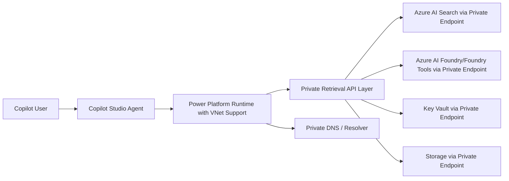
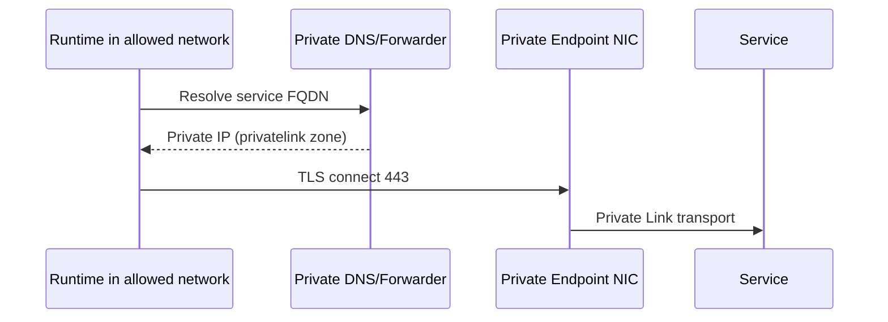
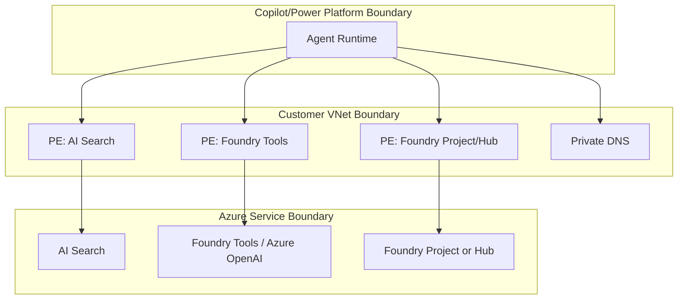

# Research Artifact

## Change log
- 2026-02-23: Replaced prior topic with deep runbook for private-only Azure AI Search + Azure AI Foundry + Copilot Studio integration.

## Executive summary
- Your likely blocker is real and documented: **Copilot Studio Azure AI Search knowledge source currently doesn't support Azure AI Search indexes configured for virtual networks**.
- A strict "no public endpoints" architecture is achievable, but not with the native Copilot Studio Azure AI Search knowledge-source path today.
- The viable pattern is:
  1) keep Azure AI Search and Foundry private-only,
  2) expose a private retrieval API layer (for example, private APIM or private Function/App Service API),
  3) invoke it from Copilot Studio through Power Platform VNet-supported runtime paths.
- DNS, endpoint approval, and operation order are the highest-risk areas. Disable public access only after private path validation.

## Problem framing
- **Target state**: Azure AI Search and Azure AI Foundry private endpoints only, no public endpoint access.
- **Business need**: Copilot Studio agents consume the solution with reliable, secure connectivity.
- **Current issue**: private-mode connection failures between services.
- **Primary technical constraint**: current native Copilot Studio + private AI Search (VNet index) limitation.

## Alignment with local architecture docs
- `docs/architecture/Instructions.txt` and `docs/architecture/CursorResearchPresentationPlaybook.md` reinforce a private-endpoint-first posture and strong validation/security workflow.
- Local docs do not yet define concrete VNet topology, DNS forwarding architecture, or subscription/resource ownership boundaries; these remain assumptions/open questions.

## Supported vs unsupported integration patterns
| Pattern | Private-only compatible | Notes |
|---|---|---|
| Copilot Studio native "Azure AI Search knowledge source" | No (currently) | Documentation explicitly notes no support for AI Search indexes configured for virtual networks |
| Copilot Studio with VNet support + private API retrieval layer | Yes | Recommended workaround for strict private networking |
| Azure AI Foundry project/hub private endpoints | Yes | Supported; project/hub differences and portal limitations must be accounted for |

## Fresh setup runbook (from scratch)

### Phase 0 - Preflight decisions
1. Confirm Foundry model:
   - Foundry **project** (newer path) vs **hub-based** path.
2. Finalize network baseline:
   - region, CIDR ranges, subnet plan, DNS strategy.
3. Finalize Copilot path:
   - if strict private-only is mandatory, do not depend on native AI Search knowledge-source connector.
   - adopt private API retrieval pattern for agent calls.

### Phase 1 - Network foundation
1. Create VNet/subnets for:
   - private endpoints
   - runtime/integration workloads
   - optional jump/admin access
2. Ensure required roles for private endpoint creation and approval.
3. If required, set VPN/ExpressRoute/Bastion for private admin access.

### Phase 2 - Azure AI Foundry private access
1. Create/update Foundry project or hub with private endpoint model.
2. Add private endpoints and confirm status `Approved`.
3. Configure private DNS zones/links (or custom DNS forwarding).
4. Disable public access after private validation passes.
5. Apply same private controls to dependent resources (storage/key vault/acr as applicable).

### Phase 3 - Foundry Tools / Azure OpenAI private access
1. Enable custom subdomain (required for certain auth/DNS scenarios).
2. Set networking to private endpoint model.
3. Create endpoint:
   - resource type: `Microsoft.CognitiveServices/accounts`
   - target subresource: `account`
4. Configure DNS zones:
   - `privatelink.cognitiveservices.azure.com`
   - `privatelink.openai.azure.com` (when applicable)
5. Configure managed identity + trusted-service exception only if needed for service-to-service flows.

### Phase 4 - Azure AI Search private access
1. Create AI Search (Basic+), then create private endpoint (`group-id searchService`).
2. Configure private DNS zone `privatelink.search.windows.net`.
3. Validate private DNS resolution from in-network host.
4. Disable public network access on AI Search.
5. Validate private endpoint connection and query/index operations via private path.

### Phase 5 - Identity and RBAC hardening
1. Enable managed identities for calling services.
2. Configure least-privilege RBAC scopes for Search/Foundry/dependencies.
3. Validate token audience/scope and role grants before full lock-down.

### Phase 6 - Copilot Studio integration (private-compatible path)
1. Enable Power Platform VNet support (Managed Environment prerequisite).
2. Use private-compatible runtime integration:
   - HTTP/private connector path to private retrieval API.
3. Avoid native AI Search knowledge-source connector for VNet-indexed search until support changes.
4. Validate end-to-end behavior and references/citations through chosen retrieval path.

### Phase 7 - Lockdown and production checks
1. Confirm all endpoint states are `Approved`.
2. Confirm all in-scope service FQDNs resolve to private IPs from runtime network.
3. Disable public access on all in-scope resources.
4. Run synthetic tests and controlled failure drills.

## Order of operations to avoid lockout
1. Build VNet/subnets/DNS first.
2. Create private endpoints and approve connections.
3. Validate DNS and 443 connectivity from intended runtime network.
4. Validate auth/RBAC.
5. Switch application/agent integration to private path.
6. Disable public access last.

## Data-plane vs control-plane expectations
- **Data plane**
  - AI Search query/index operations should traverse private endpoints from approved runtime paths.
  - Foundry model/runtime data calls should use private endpoint routing for in-scope private resources.
- **Control plane**
  - Initial provisioning and management actions may still depend on operator access model (portal/CLI/SDK) through approved management paths (for example jump host/VPN/ExpressRoute).
  - For private-only estates, validate admin tooling access path before disabling public access to avoid operational lockout.

## Recommended reference architecture


## DNS resolution flow


## Trust boundary model


## Practical snippets

### Create AI Search with public access disabled
```azurecli
az search service create \
  --name <search-name> \
  --resource-group <rg> \
  --sku Standard \
  --partition-count 1 \
  --replica-count 1 \
  --public-access Disabled
```

### Check AI Search private endpoint connection
```azurecli
az search private-endpoint-connection show \
  --name <pe-connection-name> \
  --service-name <search-name> \
  --resource-group <rg>
```

### Create private endpoint (generic pattern)
```azurecli
az network private-endpoint create \
  --name <pe-name> \
  --resource-group <rg> \
  --vnet-name <vnet-name> \
  --subnet <subnet-name> \
  --private-connection-resource-id <resource-id> \
  --group-id <group-id> \
  --connection-name <connection-name>
```

### Verify DNS and private network connectivity
```powershell
nslookup <service-fqdn>
Test-NetConnection <private-ip> -Port 443
```

### Verify RBAC assignments
```azurecli
az role assignment list --assignee <principal-id> --scope <resource-id> --output table
```

## Image references
- `artifacts/research/images/private-architecture-overview.png` - export of the recommended private architecture diagram used in design reviews.
- `artifacts/research/images/dns-resolution-validation.png` - evidence screenshot of `nslookup` showing `privatelink` resolution and private IP.
- `artifacts/research/images/private-endpoint-approval-matrix.png` - endpoint approval status snapshot across AI Search, Foundry, and dependencies.

## Validation checklist by phase
- **Private endpoint phase**
  - [ ] All endpoint states are `Approved`
  - [ ] Correct target subresources used
- **DNS phase**
  - [ ] Runtime network resolves to private IPs only
  - [ ] Private zones linked/delegated correctly
- **Auth phase**
  - [ ] Managed identities enabled where needed
  - [ ] Required role assignments present and scoped least-privilege
- **Application phase**
  - [ ] Copilot flow succeeds through private retrieval path
  - [ ] No dependency on public endpoint routing
- **Lockdown phase**
  - [ ] Public access disabled on all in-scope resources
  - [ ] Post-lockdown tests pass

## Troubleshooting playbook

### 1) Private endpoint approval failures
- Confirm endpoint status is `Approved`.
- Confirm region and subscription constraints are satisfied.
- Confirm correct resource type and group-id/subresource.

### 2) DNS failures (NXDOMAIN/wrong IP/public resolution)
- Confirm required private DNS zones exist and are linked to runtime VNet.
- Confirm custom DNS forwarding/delegation to private zones if using custom DNS.
- Confirm no stale or conflicting A records.

### 3) NSG/UDR/firewall blocks
- DNS can be correct while traffic is blocked.
- Validate outbound rules to private endpoint IPs over 443.
- Validate route tables/forced tunneling do not bypass private endpoint path.

### 4) Identity/token/RBAC errors (401/403)
- Validate managed identity enabled and principal ID used in role assignment.
- Validate token audience/scope.
- Validate role scope and propagation timing.

### 5) Copilot Studio platform limitation
- If using native Azure AI Search knowledge source with VNet-indexed search, behavior may fail due to current documented limitation.
- Use private API retrieval path for strict private networking until native support changes.

## Known gotchas
- Native Copilot Studio AI Search knowledge-source VNet limitation.
- Foundry project vs hub networking docs differ; use correct path for your resource type.
- Private endpoint creation does not guarantee success without DNS + RBAC alignment.
- Disabling public access too early can cause lockout.
- Network setting changes can require propagation time before behavior stabilizes.

## Assumptions
- Strict no-public-endpoint policy applies to Azure AI Search and Foundry resources in scope.
- You can create and approve private endpoints in target subscriptions.
- Power Platform environment supports VNet mode (Managed Environment).
- You can introduce a private retrieval API layer for Copilot Studio.

## Open questions
- Are you on Foundry project, hub, or mixed?
- Is private retrieval API layer acceptable for agent architecture?
- What is your DNS architecture (Azure Private DNS only vs custom forwarders)?
- Which subscriptions/VNets host each service and runtime path?
- Is cross-region failover required for this workload?

## References
| Claim | Source URL | Access date | Confidence |
|---|---|---|---|
| AI Search private endpoints and public disable guidance | https://learn.microsoft.com/azure/search/service-create-private-endpoint | 2026-02-23 | High |
| AI Search CLI private endpoint + private DNS workflow | https://learn.microsoft.com/azure/search/search-manage-azure-cli | 2026-02-23 | High |
| Foundry project private link setup and limitations | https://learn.microsoft.com/azure/ai-foundry/how-to/configure-private-link | 2026-02-23 | High |
| Hub-based Foundry private link setup differs from project-based path | https://learn.microsoft.com/azure/ai-foundry/how-to/hub-configure-private-link | 2026-02-23 | High |
| Foundry Tools/Cognitive Services private networking and trusted-services model | https://learn.microsoft.com/azure/ai-services/cognitive-services-virtual-networks | 2026-02-23 | High |
| Private endpoint DNS zone mappings for services | https://learn.microsoft.com/azure/private-link/private-endpoint-dns | 2026-02-23 | High |
| Copilot Studio Azure AI Search knowledge source limitation for VNet indexes | https://learn.microsoft.com/microsoft-copilot-studio/knowledge-azure-ai-search | 2026-02-23 | High |
| Copilot Studio VNet support scenarios and prerequisites | https://learn.microsoft.com/microsoft-copilot-studio/admin-network-isolation-vnet | 2026-02-23 | High |
| Azure OpenAI/Foundry private networking setup steps | https://learn.microsoft.com/azure/ai-foundry/openai/how-to/network | 2026-02-23 | High |
| On Your Data private networking interplay (Search/OpenAI/identity/trusted services) | https://learn.microsoft.com/azure/ai-foundry/openai/how-to/on-your-data-configuration | 2026-02-23 | Medium |
