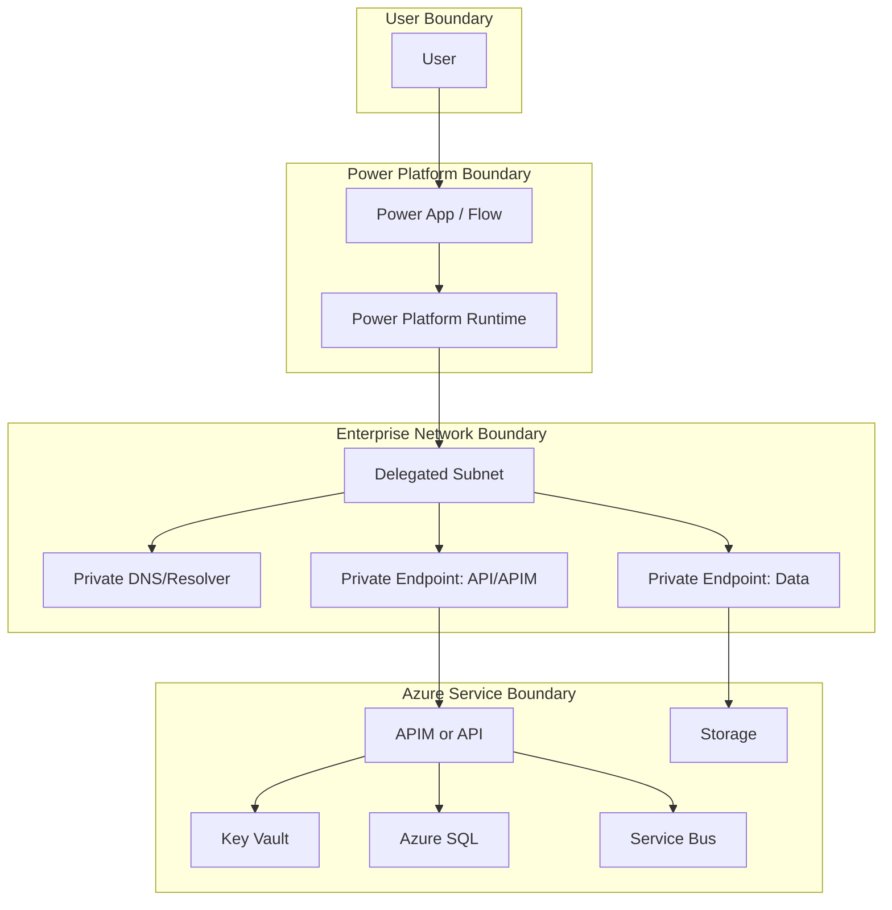

# Security Assessment

## Change log
- 2026-02-23: Replaced template with deep assessment for private-only Power Platform to Azure connectivity.

## Scope
- **In scope**
  - Power Platform environment with Virtual Network support and delegated subnet.
  - Connectivity from Power Platform workloads to private endpoint-enabled Azure resources.
  - Core services considered: Azure Functions/App Service API, APIM, Storage, Key Vault, SQL, Service Bus.
  - Identity, DNS, egress controls, and network isolation controls.
- **Out of scope**
  - Full tenant-wide IAM governance model.
  - Detailed workload data classification by business domain.
  - Per-resource hardening benchmarks beyond connectivity/security baseline.

## Assumptions
- Managed Environment is available for in-scope Power Platform environments.
- Enterprise has authority to deploy private endpoints, DNS zones, and network policy controls.
- Public network access can be disabled after migration validation.
- Existing apps/flows/connectors can be updated without major business interruption.

## Threat model summary
- **Assets**
  - Business data flowing from Power Platform to Azure resources.
  - Service credentials/secrets and OAuth clients.
  - Network trust boundaries (delegated subnet, private endpoint subnets, DNS path).
  - API contracts exposed via APIM/custom connectors.
- **Threat actors**
  - External attacker probing public endpoints.
  - Malicious insider or compromised identity with over-privileged access.
  - Misconfiguration-driven accidental exposure.
- **Primary trust boundaries**
  - User/device to Power Platform runtime.
  - Power Platform runtime to delegated subnet.
  - Delegated subnet to private endpoint interfaces.
  - Private DNS resolution path (zone/forwarder/resolver).
  - Entra token issuance and secret access boundary.

## Risk register
| Risk | Severity | Likelihood | Impact | Mitigation | Residual risk |
|---|---|---|---|---|---|
| Public endpoint remains enabled on one or more target services after private migration | High | Medium | High | Enforce explicit public-disable checklist and Azure Policy auditing; gate go-live on verification | Medium |
| DNS misconfiguration routes traffic to public endpoints or fails private resolution | High | High | High | Standardize private DNS zones/links, test DNS from runtime path, use resolver forwarding patterns | Medium |
| Over-privileged connector/API identities allow broad lateral access | High | Medium | High | Least privilege RBAC, managed identities, scoped app roles, conditional access where applicable | Medium |
| Custom connector secrets/token settings are stale or exposed | High | Medium | High | Prefer managed identity where possible, secret rotation policy, credential expiry monitoring | Medium |
| Unsupported connector behavior bypasses private architecture assumptions | Medium | Medium | High | Validate connector support matrix early; route exceptions through approved fallback patterns | Medium |
| Subnet sizing underestimation causes scale instability and outages | Medium | Medium | Medium | Capacity planning with growth headroom and environment segmentation | Low |
| NSG/UDR misconfiguration blocks required private traffic and causes outage | Medium | Medium | Medium | Staged rollout, explicit allow rules for required endpoints, pre-prod synthetic tests | Low |
| Lack of central egress governance enables data exfiltration paths | High | Medium | High | Route control via NSG/Firewall/UDR/NAT, deny-by-default outbound strategy for sensitive tiers | Medium |
| Logging gaps prevent incident triage for denied/failed private traffic | Medium | Medium | Medium | Enable diagnostics across networking and service layers; centralize in SIEM | Low |

## Identity and access controls
- Use Entra-based auth for custom connectors/APIs; avoid static shared secrets where possible.
- Prefer managed identities for service-to-service access and scoped role assignments.
- Separate identities per environment (dev/test/prod) to reduce blast radius.
- Enforce least privilege:
  - Data sender/receiver style roles for messaging.
  - Read-only where feasible for operational accounts.
- Use short-lived credentials and rotation procedures for any unavoidable secrets.

## Network controls
- **Mandatory baseline**
  - Enable Power Platform VNet support via delegated subnets.
  - Private endpoints for target services.
  - Disable public network access on services after private validation.
- **Defense in depth**
  - NSGs on integration and private endpoint subnets with explicit outbound policy.
  - UDRs for deterministic routing and inspection where required.
  - NAT/egress policy for controlled outbound internet where unavoidable.
  - Region-paired VNet design and peering for resiliency.
- **DNS controls**
  - Service-specific private DNS zones for each private endpoint type.
  - Avoid zone-sharing patterns that cause A-record conflicts.
  - Validate runtime resolution and add fallback-forwarding strategy where needed.

## Secrets and key management
- Store connector/API secrets in Key Vault and access over private endpoint.
- Disable public access for Key Vault once private path is confirmed.
- Track secret expiry and rotate before expiration; include operational alerting.
- Limit "trusted services bypass" usage to explicit, documented exceptions only.

## Logging, monitoring, and response
- Enable diagnostic logs for:
  - Private endpoint connection status changes.
  - Service network access setting changes.
  - Auth failures and token issuance anomalies.
  - Connector runtime failures and timeout patterns.
- Centralize telemetry in SIEM and define alert rules for:
  - Public network access toggled to enabled.
  - Failed private endpoint approvals.
  - Sudden DNS failure spikes.
  - Unauthorized access attempts.
- Define incident playbooks:
  - Private endpoint outage fallback.
  - DNS rollback.
  - Credential compromise response.

## Mermaid trust/flow diagram

## Prioritized action checklist
- [ ] Confirm Managed Environment status for all in-scope Power Platform environments.
- [ ] Finalize delegated subnet sizing and region-pair topology.
- [ ] Create/validate private DNS zones and VNet links for all targeted services.
- [ ] Validate private endpoint approval and runtime DNS resolution path service-by-service.
- [ ] Disable public network access on each target service after validation evidence is captured.
- [ ] Enforce least-privilege roles and remove broad/shared credentials.
- [ ] Enable policy/alerts for public access drift and private endpoint health.
- [ ] Run failover and incident response drills (DNS outage, endpoint revoke, token expiry).

## Residual risks
- Operational complexity remains moderate due to DNS and multi-service dependency chains.
- Some service/connector edge cases may still require temporary exceptions or phased migration.
- Human error in rollout sequencing (especially public disable before private validation) remains a key risk; requires strict change control.

## References
- https://learn.microsoft.com/power-platform/admin/vnet-support-overview (accessed 2026-02-23)
- https://learn.microsoft.com/power-platform/admin/vnet-support-setup-configure (accessed 2026-02-23)
- https://learn.microsoft.com/power-platform/architecture/reference-architectures/secure-access-azure-resources (accessed 2026-02-23)
- https://learn.microsoft.com/azure/private-link/private-endpoint-dns (accessed 2026-02-23)
- https://learn.microsoft.com/azure/api-management/private-endpoint (accessed 2026-02-23)
- https://learn.microsoft.com/azure/service-bus-messaging/private-link-service (accessed 2026-02-23)
- https://learn.microsoft.com/azure/key-vault/general/network-security (accessed 2026-02-23)
- https://learn.microsoft.com/azure/azure-sql/database/private-endpoint-overview?view=azuresql (accessed 2026-02-23)
- https://learn.microsoft.com/azure/storage/common/storage-network-security-set-default-access (accessed 2026-02-23)
- https://learn.microsoft.com/azure/azure-functions/functions-networking-options (accessed 2026-02-23)
