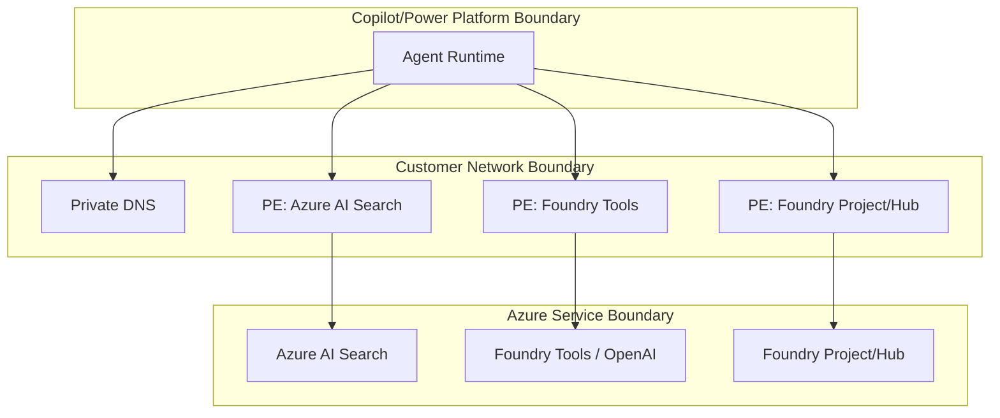
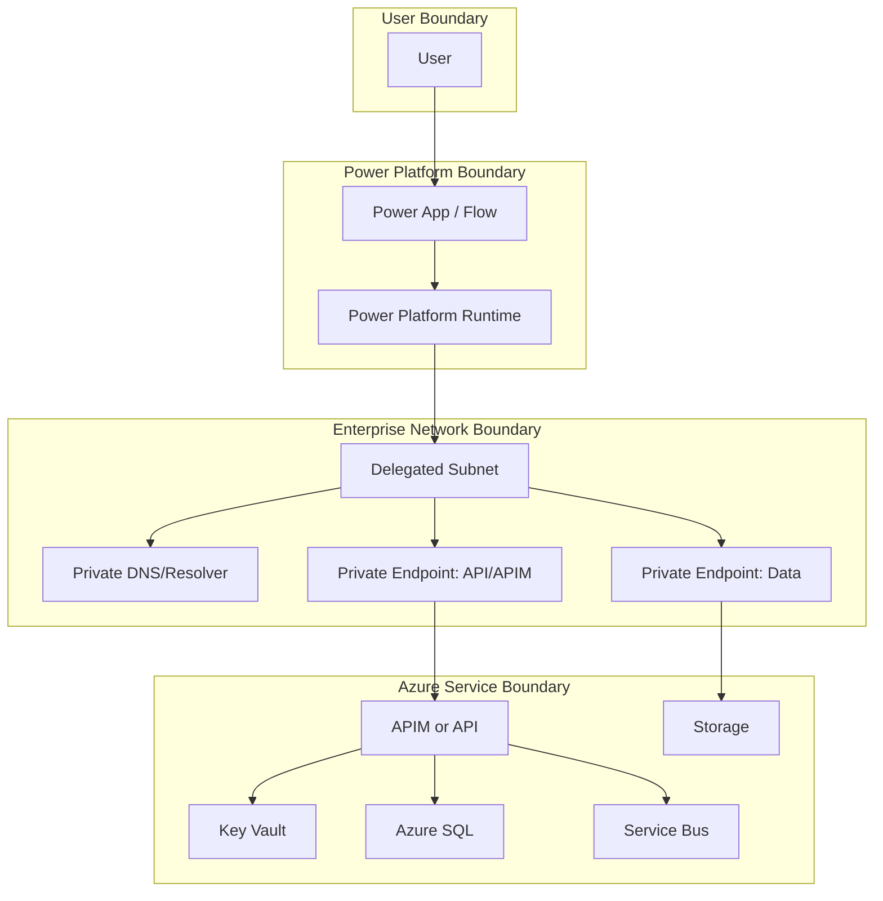

# Security Assessment

## Change log
- 2026-02-23: Replaced prior topic with security assessment for private-only Azure AI Search + Azure AI Foundry + Copilot Studio integration.

## Scope
- **In scope**
  - Azure AI Search private endpoints, DNS, RBAC, and public-disable controls.
  - Azure AI Foundry (project/hub) private networking controls and limitations.
  - Foundry Tools/Cognitive Services private networking and trusted-service exceptions.
  - Copilot Studio integration path under private networking constraints.
  - Identity, network, DNS, secrets, logging, and operational hardening controls.
- **Out of scope**
  - Tenant-wide IAM governance redesign.
  - Full data classification and retention architecture.
  - Non-Azure third-party integration controls.

## Assumptions
- Strict no-public-endpoint policy applies to in-scope Azure AI resources.
- Private endpoint and DNS administration permissions are available.
- Power Platform environment can run VNet-supported mode.
- Private API retrieval pattern is acceptable for Copilot integration if native connector path is limited.

## Threat model summary
- **Assets**
  - Search index contents and embeddings
  - Foundry project assets, prompts, model invocations
  - Secrets/tokens and managed identity trust
  - DNS resolution path and private endpoint interfaces
- **Actors**
  - External attacker targeting exposed endpoints
  - Malicious insider / compromised principal
  - Operator error introducing misconfiguration
- **Trust boundaries**
  - Copilot runtime boundary
  - Customer VNet and private endpoint boundary
  - Azure PaaS resource boundary
  - Identity/token issuance boundary

## Risk register
| Risk | Severity | Likelihood | Impact | Mitigation | Residual risk |
|---|---|---|---|---|---|
| Copilot native AI Search connector used despite VNet limitation, causing forced insecure workaround | High | High | High | Mandate private-compatible integration architecture and block unsupported pattern in design checklist | Medium |
| Public endpoint left enabled on Search/Foundry resource | High | Medium | High | Policy checks + pre-prod gate requiring explicit public-disabled evidence | Medium |
| DNS misconfiguration causes public fallback or resolution failure | High | High | High | Standardize private DNS zones, links, forwarding tests, and nslookup validation from runtime path | Medium |
| Endpoint pending/unapproved state in one dependency blocks traffic | High | Medium | High | Endpoint approval checklist and automated status checks before cutover | Low |
| Over-privileged managed identity or app registration enables lateral movement | High | Medium | High | Least-privilege RBAC, environment isolation, periodic access reviews | Medium |
| NSG/UDR/firewall denies private path traffic unexpectedly | Medium | Medium | High | Staged rollout, explicit allowlists, synthetic connectivity tests | Low |
| Token audience/scope mismatch produces intermittent 401/403 errors | Medium | Medium | Medium | Documented auth contracts, token validation checks, runbook for AAD errors | Low |
| Foundry platform/portal limitation misunderstood in production plan | Medium | Medium | High | Require project/hub mode verification and limitation review in preflight checklist | Medium |

## Identity and access controls
- Prefer managed identities for service-to-service calls.
- Use least-privilege RBAC at resource scope (avoid subscription-wide grants).
- Separate principals per environment (`dev`, `test`, `prod`) to reduce blast radius.
- Enforce credential hygiene:
  - avoid long-lived shared secrets where possible
  - monitor expiry/rotation
  - remove unused app registrations and role assignments
- Validate token scope/audience for each target endpoint before cutover.

## Network controls
- **Baseline**
  - Private endpoints for all in-scope resources.
  - Public network access disabled after private validation.
  - Runtime path constrained to approved VNets/subnets.
- **Defense in depth**
  - NSGs with explicit outbound controls.
  - UDRs/firewall where egress inspection is required.
  - deny-by-default posture for non-required flows.
- **DNS controls**
  - AI Search: `privatelink.search.windows.net`
  - Foundry Tools/Cognitive Services: `privatelink.cognitiveservices.azure.com` and service-specific zones as required
  - enforce custom DNS forwarding/delegation if not using Azure Private DNS directly

## Data and secrets protection
- Keep sensitive configuration in Key Vault behind private endpoint.
- Restrict data-plane access via RBAC and network controls jointly.
- Use CMK/encryption controls where required by policy.
- Log secret access and unauthorized attempts.

## Logging, monitoring, and response
- Enable diagnostics for:
  - private endpoint connection state changes
  - network ACL/public access changes
  - authentication failures and authorization denies
  - DNS resolution and connectivity anomalies (where observable)
- Alert on:
  - public access toggled to enabled
  - endpoint state not approved
  - repeated 401/403 spikes
  - DNS NXDOMAIN or wrong-target patterns in test telemetry
- Maintain incident playbooks for:
  - endpoint approval break
  - DNS forwarding failure
  - credential compromise

## Security architecture/trust flow

## Prioritized remediation checklist
- [ ] Confirm Foundry mode (project vs hub) and apply correct private-link pattern.
- [ ] Confirm Copilot integration design does not depend on unsupported native VNet-index path.
- [ ] Validate all private endpoint statuses are `Approved`.
- [ ] Validate DNS resolution from runtime network to private IPs only.
- [ ] Validate RBAC for managed identities and service principals (least privilege).
- [ ] Disable public network access on all in-scope resources.
- [ ] Configure alerts/policies for public-access drift and endpoint health.
- [ ] Execute tabletop for DNS outage and endpoint approval failure recovery.

## Residual risks
- Platform capability gaps may force architectural workarounds until native support evolves.
- Operational complexity remains high in multi-resource private networking.
- Change sequencing errors can still produce temporary outages without strict release controls.

## References
| Claim | Source URL | Access date | Confidence |
|---|---|---|---|
| AI Search supports private endpoint architecture and disabling public access | https://learn.microsoft.com/azure/search/service-create-private-endpoint | 2026-02-23 | High |
| AI Search operational CLI guidance includes private endpoint and DNS validation patterns | https://learn.microsoft.com/azure/search/search-manage-azure-cli | 2026-02-23 | High |
| Foundry project private-link setup includes DNS and known limitations | https://learn.microsoft.com/azure/ai-foundry/how-to/configure-private-link | 2026-02-23 | High |
| Hub-based Foundry private-link has different implementation requirements than project-based path | https://learn.microsoft.com/azure/ai-foundry/how-to/hub-configure-private-link | 2026-02-23 | High |
| Foundry Tools private networking and trusted Azure services model are documented | https://learn.microsoft.com/azure/ai-services/cognitive-services-virtual-networks | 2026-02-23 | High |
| Private endpoint DNS zone mappings are service-specific and required for correct resolution | https://learn.microsoft.com/azure/private-link/private-endpoint-dns | 2026-02-23 | High |
| Copilot Studio native AI Search knowledge source currently does not support VNet-configured indexes | https://learn.microsoft.com/microsoft-copilot-studio/knowledge-azure-ai-search | 2026-02-23 | High |
| Copilot Studio supports VNet scenarios for selected runtime integrations | https://learn.microsoft.com/microsoft-copilot-studio/admin-network-isolation-vnet | 2026-02-23 | High |
| Azure OpenAI/Foundry networking supports private endpoint configuration with public-access controls | https://learn.microsoft.com/azure/ai-foundry/openai/how-to/network | 2026-02-23 | High |
| On Your Data guidance documents private networking interplay and trusted-service patterns | https://learn.microsoft.com/azure/ai-foundry/openai/how-to/on-your-data-configuration | 2026-02-23 | Medium |
# Security Assessment

## Change log
- 2026-02-23: Replaced template with deep assessment for private-only Power Platform to Azure connectivity.

## Scope
- **In scope**
  - Power Platform environment with Virtual Network support and delegated subnet.
  - Connectivity from Power Platform workloads to private endpoint-enabled Azure resources.
  - Core services considered: Azure Functions/App Service API, APIM, Storage, Key Vault, SQL, Service Bus.
  - Identity, DNS, egress controls, and network isolation controls.
- **Out of scope**
  - Full tenant-wide IAM governance model.
  - Detailed workload data classification by business domain.
  - Per-resource hardening benchmarks beyond connectivity/security baseline.

## Assumptions
- Managed Environment is available for in-scope Power Platform environments.
- Enterprise has authority to deploy private endpoints, DNS zones, and network policy controls.
- Public network access can be disabled after migration validation.
- Existing apps/flows/connectors can be updated without major business interruption.

## Threat model summary
- **Assets**
  - Business data flowing from Power Platform to Azure resources.
  - Service credentials/secrets and OAuth clients.
  - Network trust boundaries (delegated subnet, private endpoint subnets, DNS path).
  - API contracts exposed via APIM/custom connectors.
- **Threat actors**
  - External attacker probing public endpoints.
  - Malicious insider or compromised identity with over-privileged access.
  - Misconfiguration-driven accidental exposure.
- **Primary trust boundaries**
  - User/device to Power Platform runtime.
  - Power Platform runtime to delegated subnet.
  - Delegated subnet to private endpoint interfaces.
  - Private DNS resolution path (zone/forwarder/resolver).
  - Entra token issuance and secret access boundary.

## Risk register
| Risk | Severity | Likelihood | Impact | Mitigation | Residual risk |
|---|---|---|---|---|---|
| Public endpoint remains enabled on one or more target services after private migration | High | Medium | High | Enforce explicit public-disable checklist and Azure Policy auditing; gate go-live on verification | Medium |
| DNS misconfiguration routes traffic to public endpoints or fails private resolution | High | High | High | Standardize private DNS zones/links, test DNS from runtime path, use resolver forwarding patterns | Medium |
| Over-privileged connector/API identities allow broad lateral access | High | Medium | High | Least privilege RBAC, managed identities, scoped app roles, conditional access where applicable | Medium |
| Custom connector secrets/token settings are stale or exposed | High | Medium | High | Prefer managed identity where possible, secret rotation policy, credential expiry monitoring | Medium |
| Unsupported connector behavior bypasses private architecture assumptions | Medium | Medium | High | Validate connector support matrix early; route exceptions through approved fallback patterns | Medium |
| Subnet sizing underestimation causes scale instability and outages | Medium | Medium | Medium | Capacity planning with growth headroom and environment segmentation | Low |
| NSG/UDR misconfiguration blocks required private traffic and causes outage | Medium | Medium | Medium | Staged rollout, explicit allow rules for required endpoints, pre-prod synthetic tests | Low |
| Lack of central egress governance enables data exfiltration paths | High | Medium | High | Route control via NSG/Firewall/UDR/NAT, deny-by-default outbound strategy for sensitive tiers | Medium |
| Logging gaps prevent incident triage for denied/failed private traffic | Medium | Medium | Medium | Enable diagnostics across networking and service layers; centralize in SIEM | Low |

## Identity and access controls
- Use Entra-based auth for custom connectors/APIs; avoid static shared secrets where possible.
- Prefer managed identities for service-to-service access and scoped role assignments.
- Separate identities per environment (dev/test/prod) to reduce blast radius.
- Enforce least privilege:
  - Data sender/receiver style roles for messaging.
  - Read-only where feasible for operational accounts.
- Use short-lived credentials and rotation procedures for any unavoidable secrets.

## Network controls
- **Mandatory baseline**
  - Enable Power Platform VNet support via delegated subnets.
  - Private endpoints for target services.
  - Disable public network access on services after private validation.
- **Defense in depth**
  - NSGs on integration and private endpoint subnets with explicit outbound policy.
  - UDRs for deterministic routing and inspection where required.
  - NAT/egress policy for controlled outbound internet where unavoidable.
  - Region-paired VNet design and peering for resiliency.
- **DNS controls**
  - Service-specific private DNS zones for each private endpoint type.
  - Avoid zone-sharing patterns that cause A-record conflicts.
  - Validate runtime resolution and add fallback-forwarding strategy where needed.

## Secrets and key management
- Store connector/API secrets in Key Vault and access over private endpoint.
- Disable public access for Key Vault once private path is confirmed.
- Track secret expiry and rotate before expiration; include operational alerting.
- Limit "trusted services bypass" usage to explicit, documented exceptions only.

## Logging, monitoring, and response
- Enable diagnostic logs for:
  - Private endpoint connection status changes.
  - Service network access setting changes.
  - Auth failures and token issuance anomalies.
  - Connector runtime failures and timeout patterns.
- Centralize telemetry in SIEM and define alert rules for:
  - Public network access toggled to enabled.
  - Failed private endpoint approvals.
  - Sudden DNS failure spikes.
  - Unauthorized access attempts.
- Define incident playbooks:
  - Private endpoint outage fallback.
  - DNS rollback.
  - Credential compromise response.

## Mermaid trust/flow diagram

## Prioritized action checklist
- [ ] Confirm Managed Environment status for all in-scope Power Platform environments.
- [ ] Finalize delegated subnet sizing and region-pair topology.
- [ ] Create/validate private DNS zones and VNet links for all targeted services.
- [ ] Validate private endpoint approval and runtime DNS resolution path service-by-service.
- [ ] Disable public network access on each target service after validation evidence is captured.
- [ ] Enforce least-privilege roles and remove broad/shared credentials.
- [ ] Enable policy/alerts for public access drift and private endpoint health.
- [ ] Run failover and incident response drills (DNS outage, endpoint revoke, token expiry).

## Residual risks
- Operational complexity remains moderate due to DNS and multi-service dependency chains.
- Some service/connector edge cases may still require temporary exceptions or phased migration.
- Human error in rollout sequencing (especially public disable before private validation) remains a key risk; requires strict change control.

## References
- https://learn.microsoft.com/power-platform/admin/vnet-support-overview (accessed 2026-02-23)
- https://learn.microsoft.com/power-platform/admin/vnet-support-setup-configure (accessed 2026-02-23)
- https://learn.microsoft.com/power-platform/architecture/reference-architectures/secure-access-azure-resources (accessed 2026-02-23)
- https://learn.microsoft.com/azure/private-link/private-endpoint-dns (accessed 2026-02-23)
- https://learn.microsoft.com/azure/api-management/private-endpoint (accessed 2026-02-23)
- https://learn.microsoft.com/azure/service-bus-messaging/private-link-service (accessed 2026-02-23)
- https://learn.microsoft.com/azure/key-vault/general/network-security (accessed 2026-02-23)
- https://learn.microsoft.com/azure/azure-sql/database/private-endpoint-overview?view=azuresql (accessed 2026-02-23)
- https://learn.microsoft.com/azure/storage/common/storage-network-security-set-default-access (accessed 2026-02-23)
- https://learn.microsoft.com/azure/azure-functions/functions-networking-options (accessed 2026-02-23)
